

# 浏览器中运行的Python开发环境的实例演示

本实例演示网站是将JupyterLite部署在GitHub Pages上的静态网站。请使用Firefox 90+或者Chromium 89+的浏览器打开下面的链接。

**https://ruoyu0088.github.io/jupyterlite_demos/lab/index.html**

如果你想创建自己的JupyterLite网站，请参看下面的链接：

https://jupyterlite.readthedocs.io/en/latest/quickstart/deploy.html

# 实例演示目录

## 使用PySAT求解各种谜题游戏

### 数独

在输入数独盘面中的数字时，实时显示求解结果：

https://ruoyu0088.github.io/jupyterlite_demos/lab?path=pysat%2Fsudoku_solver.ipynb

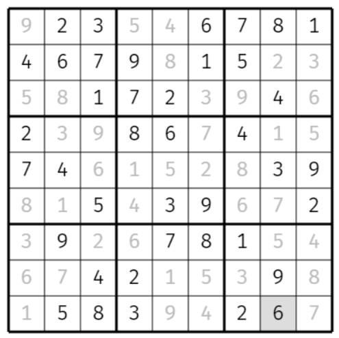

### 数方(shikaku)求解器

每个数字表示包含该数字的长方形的面积。

https://ruoyu0088.github.io/jupyterlite_demos/lab?path=pysat%2Fshikaku_solver.ipynb

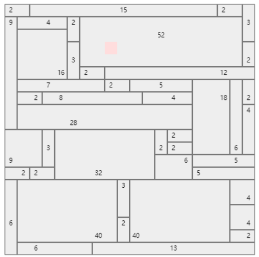

### 数织求解器

数织是一种逻辑游戏，以猜谜的方式绘画黑白位图。在一个网格中，每一行和列都有一组数，玩家需根据它们来填满或留空格子，最后就可以由此得出一幅图画。

https://ruoyu0088.github.io/jupyterlite_demos/lab?path=pysat%2Fnonogram_solver.ipynb

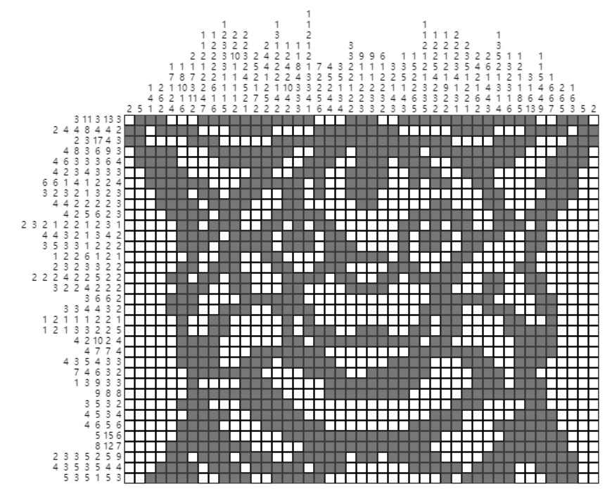

### 数连(number link)求解器

将相同的数字用沿水平和竖直方向经过所有白格的中心的线连起来，线不能交叉。

https://ruoyu0088.github.io/jupyterlite_demos/lab?path=pysat%2Fnumber_link.ipynb

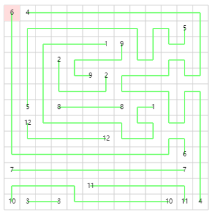

### 数回(Slitherlink)求解器

画出一条连接相邻黑点的回路，每个数字表示该方格四周四条边在回路中的个数。

https://ruoyu0088.github.io/jupyterlite_demos/lab?path=pysat%2Fslitherlink.ipynb

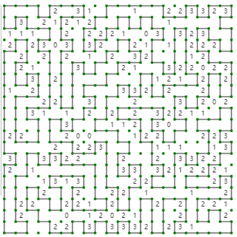

### 3D磁铁方块拼图

使用几种类似俄罗斯方块的形状拼出指定的三维造型：

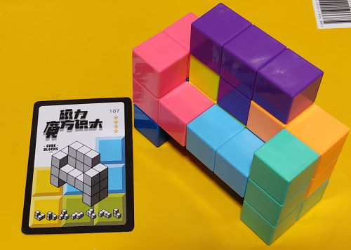

https://ruoyu0088.github.io/jupyterlite_demos/lab?path=pysat%2Fmagnetcube.ipynb

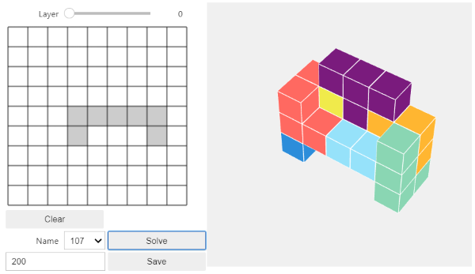

## 最优化

### 行走的仿生兽

使用SciPy最优化工具和SymPy的符号运算功能，计算Theo Jansen仿生兽的行走运动。

https://ruoyu0088.github.io/jupyterlite_demos/lab?path=optimize%2Frobot_walk.ipynb

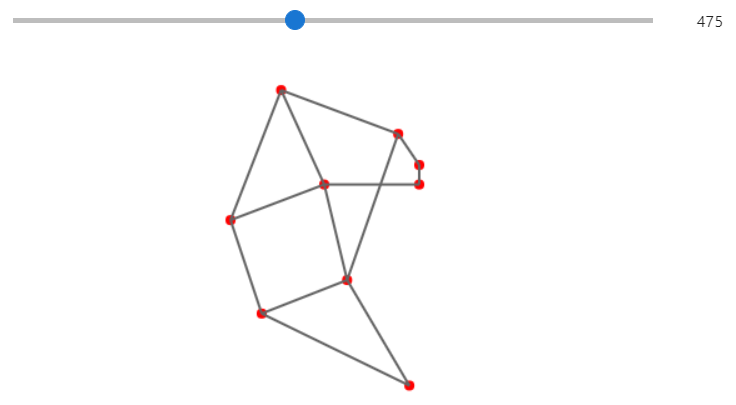

### 用蚁群算法求解旅行推销员问题

给定一系列城市和每对城市之间的距离，求解访问每一座城市一次并回到起始城市的最短回路。这是组合优化中的一个NP困难问题，本例使用蚁群算法计算该问题的近似最优解。

https://ruoyu0088.github.io/jupyterlite_demos/lab?path=optimize%2Fant-colony-salesman.ipynb

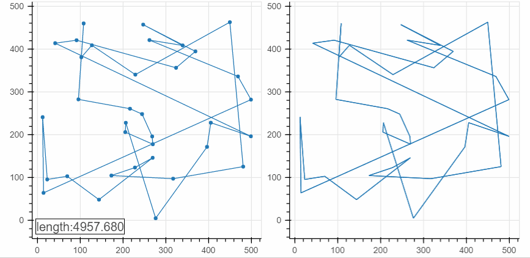

## 绘图

### 朱利亚集合

使用cffi载入C语言编译而得的WASM文件，实现朱利亚集合的实时计算。

https://ruoyu0088.github.io/jupyterlite_demos/lab?path=plots%2Fjulia_set.ipynb

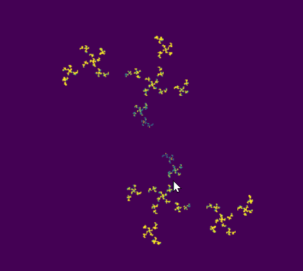

### L-System

使用字符串的替代绘制分形图案。

https://ruoyu0088.github.io/jupyterlite_demos/lab?path=plots%2Flsystem.ipynb

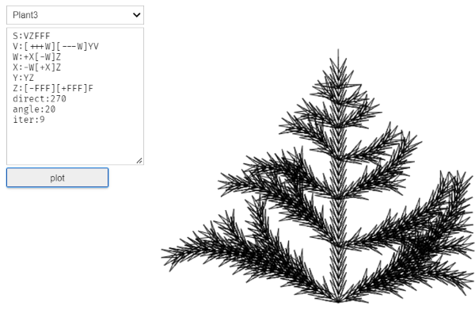

### 迭代函数系统

通过多个三角形定义仿射变换，并进行随机迭代绘制分形图案。

https://ruoyu0088.github.io/jupyterlite_demos/lab?path=plots%2Fifs.ipynb

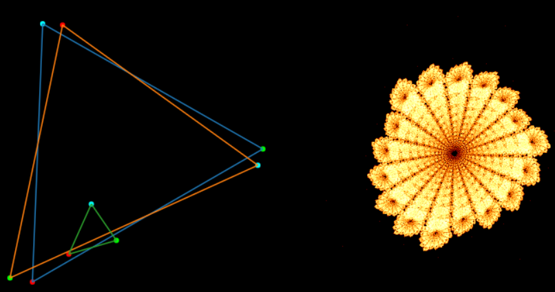

### 玫瑰花

使用Plotly的三维绘图功能绘制。

https://ruoyu0088.github.io/jupyterlite_demos/lab?path=plots%2Fplots_01.ipynb

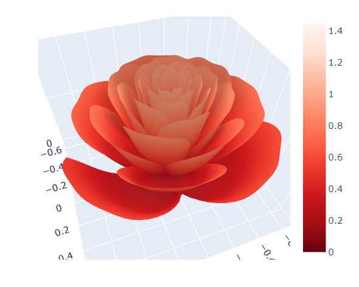

### 数学跳棋Prime Climb的棋盘

[Prime Climb](https://mathforlove.com/games/prime-climb/)是学习乘法和因数分解的算术游戏。本程序使用Bokeh绘制游戏的棋盘。

https://ruoyu0088.github.io/jupyterlite_demos/lab?path=plots%2Fprime_climb_draw.ipynb

## 图论

### 华容道

使用SciPy的最短路径搜索算法`dijkstra()`计算华容道的最短解。

https://ruoyu0088.github.io/jupyterlite_demos/lab?path=graph%2Fklotski_solver.ipynb

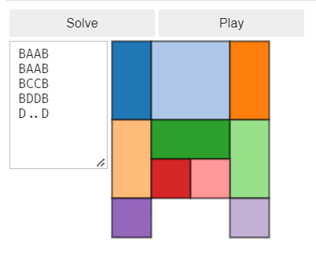

## 模拟

### 蚁群

每只蚂蚁通过散发两种气味的化学物质和其他蚂蚁进行交流，一起将食物搬回家。

https://ruoyu0088.github.io/jupyterlite_demos/lab?path=simulation%2Fants.ipynb

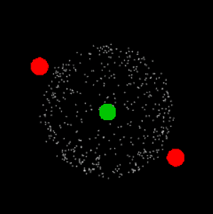

### 粒子生命

对各种粒子之间施加引力和斥力，使用运动方程计算各个粒子的位置和速度，形成有趣的运动模式。

https://ruoyu0088.github.io/jupyterlite_demos/lab?path=simulation%2Fparticle_life.ipynb

## 几何

### 平面几何脚本

使用SolveSpace的约束几何求解器编写的平面几何脚本，可以快速绘制和计算平面几何图形。

https://ruoyu0088.github.io/jupyterlite_demos/lab?path=geometry%2Fgeometry_script.ipynb

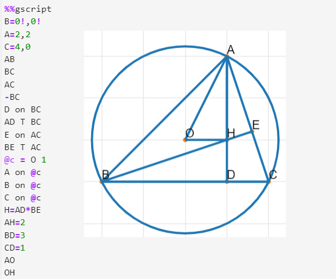

### 行走的仿生兽

使用上面的平面几何脚本计算仿生兽的行走动画。

https://ruoyu0088.github.io/jupyterlite_demos/lab?path=geometry%2Fstrandbeest_walk.ipynb

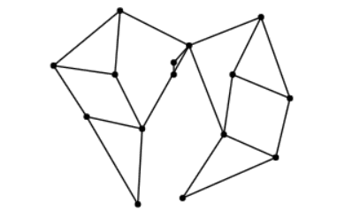

## 控制

### N段摆控制

使用SymPy计算N段摆的运动方程，将其线性化。使用SciPy计算控制增益，并对N段摆的控制系统进行模拟。

https://ruoyu0088.github.io/jupyterlite_demos/lab?path=control%2Fpendulum_control.ipynb

